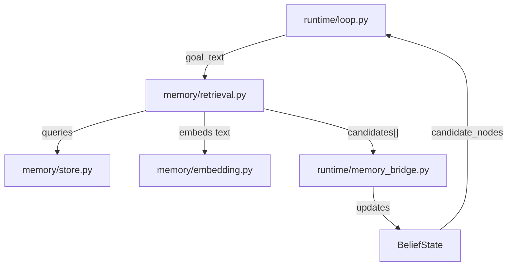

# Memory-Guided Search Integration

## Overview

Add semantic memory capabilities to enable memory-guided search when targets are not visible, with deterministic retrieval and correct BeliefState transitions that respect existing invariants.

## Architecture




## Key Design Decisions (Updated Requirements)

### 1. Score Range & Mapping

- Cosine similarity produces values in [-1, 1]
- Map to intuitive [0, 1] range: `score = (cos + 1.0) / 2.0`
- Threshold `MEMORY_SCORE_THRESH = 0.3` is now meaningful on [0,1] scale

### 2. Deterministic Ordering

- Sort nodes by `node_id` before scoring (consistent iteration order)
- Sort final candidates with tie-break: `sorted(key=lambda c: (-c["score"], c["node_id"]))`
- Guarantees identical outputs for identical inputs

### 3. Monotonic State Transitions (No Flapping)

- `visible` status: NEVER changed by retrieval (only updates candidate_nodes)
- `likely_in_memory` status: NOT demoted to `searching` on weak retrieval
- Only promote `searching` → `likely_in_memory` when score >= threshold
- Prevents oscillation between states

### 4. Hybrid Scoring (Embeddings + Keywords)

- Always blend: `final_score = 0.8 * embedding_score + 0.2 * keyword_score`
- Keyword overlap: deterministic token intersection normalized to [0,1]
- Provides robustness even with stub embeddings

### 5. Robust Integration & Edge Cases

- Retrieval inserted after belief copy, before VLM step (anchored by comment)
- **Shared tokenize helper**: `tokenize(text) -> list[str] `in `memory/utils.py`
- Robust normalization: lowercase, strip, remove punctuation (`re.sub(r'[^\w\s]', '', text)`), split whitespace
- Returns list of non-empty tokens
- **Token-based retrieval_ran**: In `runtime/loop.py`:
- Compute `tokens = tokenize(belief["goal_text"])`
- Set `retrieval_ran = len(tokens) > 0` (NOT based on raw `goal_text != ""` or candidates)
- Only call `retrieve_candidates()` when `retrieval_ran == True`
- Otherwise set `candidates = []`
- **Empty token handling**: Handles empty strings, whitespace-only, punctuation-only inputs gracefully
- **Logging discipline**: Only store `{node_id, score}` in `retrieval_topk`, no full node payloads
- **Seed store**: `seed_demo_store()` is dev/test only, add TODO comment for production SLAM data
- **Schema safety**: `belief["candidate_nodes"] = candidates `always set (even if `[]`)

## Implementation Steps

### Phase A: Memory Foundation (New Modules)

**1. Create `memory/types.py`**

- Define `Pose2D(x: float, y: float, yaw: float)` dataclass
- Define `MemoryNode(node_id: int, pose: Pose2D, embedding: list[float] | None, tags: list[str], summary: str)` dataclass
- Add type hints and docstrings

**2. Create `memory/store.py`**

- Implement `SemanticMemoryStore` class with internal `nodes: dict[int, MemoryNode]`
- Methods: `add_node()`, `get_node()`, `all_nodes()`
- Optional: `save_json()`, `load_json()` for persistence
- Provide `seed_demo_store()` helper to create 3-5 demo nodes for testing

**3. Create `memory/embedding.py`**

- Implement `DeterministicEmbedder(dim=64)` class
- Method: `embed_text(text: str) -> list[float]`
- Normalize text (lowercase, strip)
- Use stable hash (e.g., `hashlib.md5`) → seed RNG
- Generate deterministic vector with seeded `random.Random`
- Return normalized vector (unit length)
- Helper: `normalize(vec: list[float]) -> list[float]` function

**3b. Create `memory/utils.py` (or add to `memory/retrieval.py`)**

- Implement shared `tokenize(text: str) -> list[str]` helper
- Logic:
- Lowercase, strip
- Remove punctuation: `re.sub(r'[^\w\s]', '', text)`
- Split on whitespace
- Return list of non-empty tokens
- This function is used by both `retrieve_candidates` internally AND by `runtime/loop.py` to determine `retrieval_ran`

**4. Create `memory/retrieval.py`**

- Implement `retrieve_candidates(goal_text: str, store: SemanticMemoryStore, embedder: DeterministicEmbedder, k: int = 5) -> list[dict]`
- **Tokenization**: Use shared `tokenize(goal_text)` helper from `memory/utils.py`
- If `goal_tokens` is empty: **return `[]` immediately** (no retrieval)
- Note: Caller (`runtime/loop.py`) will have already checked tokens, but this provides defense-in-depth
- **Deterministic iteration**: Sort nodes by `node_id` before scoring to ensure consistent order
- Scoring logic for each node:
- Tokenize node content: `node_tokens = set(tokenize(node.summary + " " + " ".join(node.tags)))`
- Compute cosine similarity: `cos = dot(u,v) / (||u|| * ||v||)` where u is goal embedding, v is node embedding (or embed node text)
- Map cosine [-1,1] to [0,1]: `embedding_score = (cos + 1.0) / 2.0`
- Compute keyword overlap: `keyword_score = len(set(goal_tokens) & node_tokens) / len(goal_tokens)` (safe since we already checked goal_tokens non-empty)
- **Always blend**: `final_score = 0.8 * embedding_score + 0.2 * keyword_score`
- Clamp final score to [0.0, 1.0] for numeric safety
- Sort candidates with explicit tie-break: `sorted(cands, key=lambda c: (-c["score"], c["node_id"]))`
- Return top-k (limit to k=5): `[{"node_id": int, "score": float}, ...]` (only these fields, no full node payloads)
- **Critical**: Ensure `score` is Python `float` (not numpy)

### Phase B: Belief State Integration

**5. Create `runtime/memory_bridge.py`**

- Implement `apply_memory_retrieval(belief: dict, candidates: list[dict], threshold: float = 0.3) -> dict`
- **Monotonicity / No Flapping**: Prevent oscillation between statuses
- **Explicit status handling for ALL cases**:
- Always set `belief["candidate_nodes"] = candidates `(or `[]` if none)
- If `target_status == "visible"`: **NEVER change status** (only update candidate_nodes for logging)
- If `target_status == "done"` or `"unreachable"`: **do not change status** (only update candidate_nodes for logging)
- If `target_status == "likely_in_memory"`:
    - **Do NOT demote** to `"searching"` on weak retrieval (no flapping)
    - Keep status as-is (remains `"likely_in_memory"`)
- If `target_status == "searching"`:
    - If candidates exist and `candidates[0]["score"] >= threshold`: promote to `"likely_in_memory"`
    - Otherwise: remain `"searching"`

### Phase C: Runtime Loop Integration

**6. Modify [`runtime/loop.py`](runtime/loop.py)**Key changes:

- Add imports for memory modules at top: `from memory.utils import tokenize` (and others)
- Define `MEMORY_SCORE_THRESH = 0.3` constant (meaningful on [0,1] scale)
- In `main()`: instantiate `SemanticMemoryStore` and `DeterministicEmbedder` once (use `seed_demo_store()`)
- **Add comment**: `# TODO: Replace seed_demo_store() with persisted SLAM-derived nodes in production`
- In main loop iteration:
- **Integration anchor**: Right after `belief_before = json.loads(json.dumps(belief))`, before VLM generation
- Add a clear comment: `# === Memory retrieval step ===`
- **Token-based retrieval logic**:
    ```python
            # Tokenize goal_text to determine if retrieval should run
            tokens = tokenize(belief["goal_text"])
            retrieval_ran = len(tokens) > 0
            
            # Only call retrieve_candidates if we have valid tokens
            if retrieval_ran:
                candidates = retrieve_candidates(belief["goal_text"], store, embedder, k=5)
            else:
                candidates = []
            
            # Always update belief with candidates (even if empty) for schema safety
            apply_memory_retrieval(belief, candidates, MEMORY_SCORE_THRESH)
    ```


- Add retrieval metadata to `meta` dict:
    - `retrieval_ran: bool` - Set directly from token count: `len(tokens) > 0`
    - `retrieval_topk: list[dict]` - Store only `[{"node_id": int, "score": float}, ...]` (no full node payloads, keep k<=5)
    - `retrieval_best_score: float | None` - `candidates[0]["score"] `if candidates else `None`
    - `retrieval_threshold_pass: bool` - `best_score >= threshold` if candidates else `False`
- **Schema safety**: `belief["candidate_nodes"] = candidates `always set (even if `[]`) so schema validation passes
- Ensure existing schema validation still runs and passes
- Preserve Windows-safe `$ref` resolution

### Phase D: Tests

**7. Create `tests/test_memory_retrieval.py`**

- Test deterministic ordering:
- Create store with 3 nodes (known tags/summary), add in non-sorted order
- Call `retrieve_candidates()` twice with same input
- Assert outputs are identical (same order, same scores)
- Test tie-break behavior:
- Create 2 nodes with identical scores
- Assert lower node_id comes first in results
- Test score range [0,1]:
- Assert each candidate has `int` node_id and `float` score in [0.0, 1.0]
- Verify score mapping: cosine=-1 → score≈0, cosine=0 → score≈0.5, cosine=1 → score≈1.0
- Test keyword blending:
- Create nodes with known embeddings and tags
- Verify final_score = 0.8*embedding_score + 0.2*keyword_score
- Test empty/invalid goal_text edge cases:
- Empty string: assert returns []
- Whitespace-only: `"   "` assert returns []
- Punctuation-only: `"!!!"` or `"..."` assert returns []
- Verify these all result in schema-safe empty candidate list

**8. Create `tests/test_memory_bridge.py`**

- Test invariant: visible never demotes
- Set `belief["target_status"] = "visible"`
- Call `apply_memory_retrieval()` with low-score candidates
- Assert status remains "visible"
- Test promotion: searching → likely_in_memory
- Set `belief["target_status"] = "searching"`
- Call with high-score candidate (score >= threshold)
- Assert status becomes "likely_in_memory"
- Test no flapping: likely_in_memory does NOT demote to searching
- Set `belief["target_status"] = "likely_in_memory"`
- Call with low-score candidates (score < threshold)
- Assert status remains "likely_in_memory" (NOT demoted to "searching")
- Test terminal states unchanged: done/unreachable
- Set `belief["target_status"] = "done"`, call with high-score candidates
- Assert status remains "done" (not changed by retrieval)
- Set `belief["target_status"] = "unreachable"`, call with high-score candidates
- Assert status remains "unreachable"
- Test candidate_nodes always set:
- Verify `belief["candidate_nodes"]` equals input candidates for all status cases
- Test with empty candidates: `belief["candidate_nodes"] = []`
- Test punctuation-only goal integration:
- Set up belief with `goal_text = "!!!"`
- Call retrieval → should get `candidates = []`
- Call bridge → should have `candidate_nodes = []` and `retrieval_ran = False`
- Verify belief still passes schema validation

**9. Setup pytest infrastructure**

- Create `tests/__init__.py`
- Create `pytest.ini` with basic config
- Ensure tests can import from parent modules

### Phase E: Quality & Documentation

**10. Code Quality**

- Add comprehensive docstrings to all new functions/classes
- Add type hints throughout (use `from typing import ...`)
- Keep dependencies minimal (no numpy - implement cosine manually)
- Follow existing code style from [`runtime/loop.py`](runtime/loop.py)

**11. Optional Documentation Update**

- Add brief note in [`docs/interface_contract.md`](docs/interface_contract.md) that memory fills `candidate_nodes` field

## Critical Constraints

### Schema Compatibility

- `candidate_nodes` entries must be `{"node_id": int, "score": float}` (already in schema)
- Scores must be Python `float` type (not numpy) in range [0.0, 1.0]
- Map cosine similarity [-1,1] to score [0,1] via: `score = (cos + 1.0) / 2.0`

### Transition Invariants

- **NEVER demote** `visible` → any other status due to retrieval
- **NEVER demote** `likely_in_memory` → `searching` due to weak retrieval (no flapping)
- Only promote from `searching` to `likely_in_memory` when score >= threshold
- Retrieval may run when visible=true for logging, but must not change status

### Determinism

- All retrieval must be deterministic with same inputs
- Sort nodes by `node_id` before scoring
- Sort results with tie-break: `(-score, node_id)`
- Use seeded hash-based RNG for stub embeddings
- Consistent text normalization and keyword tokenization

### Logging

- Add retrieval metadata to existing `meta` dict in JSONL logs
- Do not break current log format

## Acceptance Criteria

- [ ] `python -m runtime.loop --self-check` passes
- [ ] `pytest -q` passes all new tests
- [ ] Retrieval produces deterministic outputs with consistent tie-breaking
- [ ] Scores mapped correctly: cosine [-1,1] → [0,1] via (cos+1)/2
- [ ] Keyword blending: 0.8*embedding + 0.2*keywords always applied
- [ ] BeliefState schema validation passes with candidate_nodes populated
- [ ] Visible→any demotion never occurs due to retrieval
- [ ] likely_in_memory→searching demotion never occurs (no flapping)
- [ ] done/unreachable statuses never changed by retrieval
- [ ] Empty/whitespace/punctuation-only goal_text → `[]` results, `retrieval_ran=False`, schema passes
- [ ] retrieval_ran based on token processing, not raw goal_text check
- [ ] Logging only stores {node_id, score}, not full node payloads
- [ ] Scores are correct Python float type in [0.0, 1.0] range
- [ ] seed_demo_store() usage marked with TODO for production replacement

## Key Files